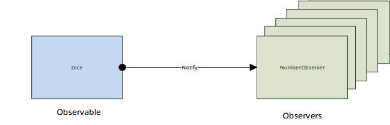

# POSE 5ABIF/5ACIF

## DiceSimulation

Lehrziele

- Erstellen von einfachen Klassen
- Erstellen einer einfachen Schnittstelle
- Wie eine Observable-Klasse erstellt wird
- Wie eine Observer-Klasse erstellt wird
- Wie die Objekte Observable und Observer verbunden werden

### Aufgabenstellung

Es soll eine einfache Würfel-Simulation erstellt werden. Dabei wird ein Würfel (Dice) beliebig oft
geworfen und die geworfenen Augenzahlen notiert. Je öfter der Würfel geworfen wird, desto mehr
sollte sich die Verteilung der Augenzahlen einer Gleichverteilung nähern (n -> ∞). Wenn sich die
Verteilung der Augenzahlen nicht der Gleichverteilung nähert, dann kann davon ausgegangen
werden, dass der Würfel manipuliert wurde.

**Design der Lösung**

Die Struktur der Lösung sollte als Observer-Pattern implementiert werden. Dabei stellt der Würfel
das Observable-Objekt dar und verständigt nach jedem Würf alle registrierten Observer-Objekte.
Diese Observer-Objekte notieren die Anzahl der geworfenen Augenzahl und berechnen das
Verhältnis zu den gesamt Würfen. In der folgenden Abbildung soll die Lösungsstruktur skizziert
werden:

Klasse `Dice`

Diese Klasse soll einen Würfel darstellen und simulieren.

**Eigenschaften:**

|   |   |   |   |
|---|---|---|---|
| public | int Count | Ruft die Anzahl von Wuerfen ab. (ReadOnly) |   |
| public  | int LastNumber | Ruft den letzten Wurf ab. (ReadOnly) |   |

**Methoden/Konstruktor:**

|   |   |   |   |
|---|---|---|---|
| public | Dice() | Initialisiert eine neue Instanz der Dice-Klasse. |   |

**Methoden:**

|   |   |   |   |
|---|---|---|---|
| public | void Roll() | Erzeugt einen neuen Wurf und verständigt die registrierten Beobachter. |   |
| public  | void Reset() | Setzt alle Werte wieder auf den Anfangszustand zurück. |   |
| public  | void AddObserver(IObserver observer) | Fuegt einen Observer hinzu. |   |
| public  | void RemoveObserver(IObserver observer) | Entfernt den Observer aus der liste. |   |
| protected  | void NotifyObservers() | Diese Methode verständigt alle Abonennten. |   |

Klasse `NumberObserver`

Diese Klasse dient als Beobachter der Klasse Dice. 

**Eigenschaften:**

|   |   |   |   |
|---|---|---|---|
| public | int Count | Ruft die Anzahl von Wuerfen ab. (ReadOnly) |   |
| public  | int WatchCount | Ruft die Anzahl der beobachteten Zahl ab. (ReadOnly) |   |
| public  | int WatchNumber | Ruft die Zahl ab, welche beobachtet wird. (ReadOnly) |   |

**Methoden/Konstruktor:**

|   |   |   |   |
|---|---|---|---|
| public | NumberObserver(int watchNumber) | Initialisiert eine neue Instanz der NumberObserver-Klasse mit der zu beobachteten Zahl. |   |

**Methoden:**

|   |   |   |   |
|---|---|---|---|
| public | void Notify(...) | Diese Methode wird vom Observable-Objekt (Dice) aufgerufen. |   |
| public  | string ToString() | Konvertiert die Statistikdaten zu einer Zeichenfolge. |   |

**Benutzerdialog**

